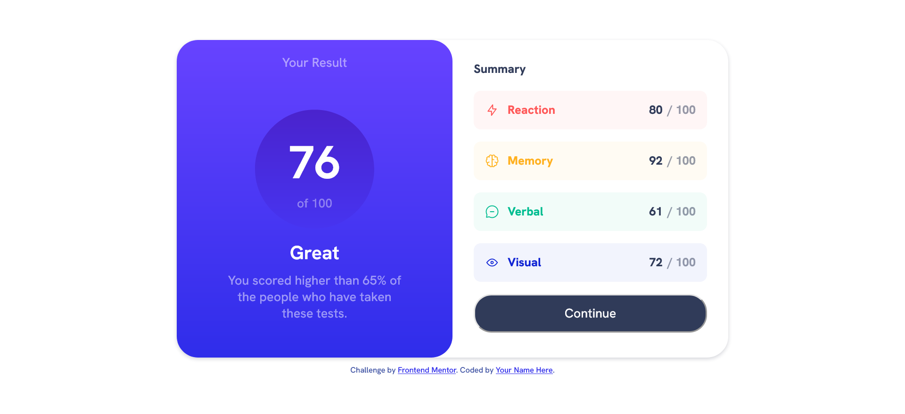
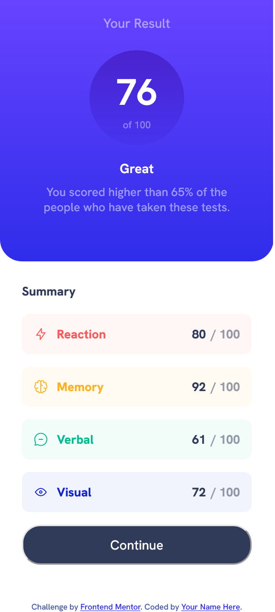

# Frontend Mentor - Results summary component solution

This is a solution to the [Results summary component challenge on Frontend Mentor](https://www.frontendmentor.io/challenges/results-summary-component-CE_K6s0maV). Frontend Mentor challenges help you improve your coding skills by building realistic projects. 

## Table of contents

- [Overview](#overview)
  - [The challenge](#the-challenge)
  - [Screenshot](#screenshot)
  - [Links](#links)
- [My process](#my-process)
  - [Built with](#built-with)
  - [What I learned](#what-i-learned)
  - [Continued development](#continued-development)
- [Acknowledgments](#acknowledgments)


## Overview

### The challenge

Users should be able to:

- View the optimal layout for the interface depending on their device's screen size
- See hover and focus states for all interactive elements on the page
- **Bonus**: Use the local JSON data to dynamically populate the content

### Screenshot

Desktop Version:




Mobile Version:




### Links

- Live Site URL: [live site](https://claraz4.github.io/Result-Summary/)

## My process

### Built with

- Semantic HTML5 markup
- CSS custom properties
- Flexbox
- Mobile-first workflow


### What I learned

This project really boosted my CSS skills, especially when it comes to improving my responsive designs, and my flexbox skills.

As I went along, I stumbled upon this cool gradient effect you can do in CSS:
```css
#result-box {
    background: linear-gradient(#6743ff, #2f2dea);
    /* More properties */
}
```

### Continued development

I still can implement the utilization of local JSON data for dynamic result and score updates. Additionally, I can further enhance the project's responsive design.


## Acknowledgments

I came across a youtube video that helped me a lot in Web Development: [frontend bootcamp](https://www.youtube.com/watch?v=zJSY8tbf_ys)

